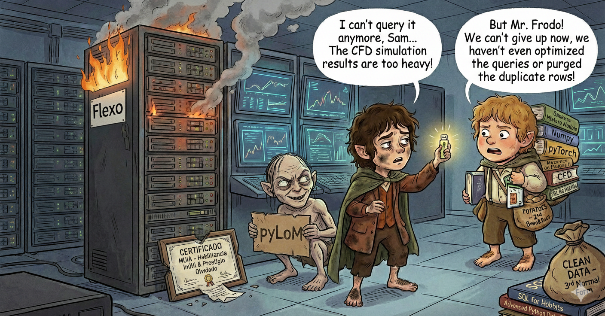

# Fellowship of the Ring

## Intro y los panas

Buenos días.

Si estás por aquí es que vienes a conocer una de las más grandes obras de la literatura, cine y cultura humana que ha existido jamás. Vienes a conocer a la Comunidad del Anillo, ese grupo de héroes y personajes cuya misión es devolver el Anillo Único a su lugar de creación para destruirlo, y así frustar la vuelta del Señor Oscuro, Sauron.

Sin más dilación, y currándome esto menos de lo que debería, vamos a introducir a los personajes principales:
- FRODO (Framework for Reusable Organized Data Output): Es el personaje principal de nuestro grupo y se dedica a manejar la base de datos (el anillo que nadie quiere pero te da toda la información) para que la moldeemos a nuestro gusto. Podemos calcular variables internas, elegir parámetros y organizar los datos.

- SAM (Simulations & Analytics Module): Como en los personajes originales, FRODO se lleva el mérito sin llevar la mochila de los juguetes que nos salvan la vida. SAM lleva ahora y siempre esa mochila donde tenemos las herramientas principales de cálculo y distribución. Cuando FRODO se ralle la cabeza con diccionarios más largos que una clase de Certi y operaciones dignas de un examen de Aerodinámica, habrá un rayo de esperanza, un abrazo consolador, un héroe sin capa que nos sostiene. Ese héroe es SAM.

- SMEAGOL: Jodido pero necesario de tragar, SMEAGOL (pyLOM en el fondo) es un personaje que nos muestra caminos que no nos gustan con formas y comportamientos que no nos dan buena espina, pero que en el fondo funcionan. ¿Tienes que llevarle contigo? Si. ¿Debes fiarte de él? Nunca. ¿Es complicado de manejar? Hasta para pedir la hora. ¿Puede que te traicione de vez en cuando? Tenlo por seguro. Es lo que hay.

- LEGOLAS (Lightweight Exploratory Graphics Of Loaded Aerodynamic Simulations): En todo grupo de amigos de aventuras siempre hay alguien guapo que nos deja en segundo plano. Alguien que libra todas sus batallas con un glamur y una elegancia que no sabes si es admiración o envidia lo que sientes. Alguien que no se le mueve un pelo de su impresionante imagen a pesar de que llevéis 11 horas luchando contra orcos. Y no por eso se le tiene que dejar de querer a nuestro elfo favorito, a nuestro Orlando Bloom, a nuestro lanzaflechas infinito, a nuestro Légolas. Él nos va a ayudar a darle un poco de color y vida a los datos que manejamos en la Comunidad, aportando sus ojos e imagen para dislumbrar problemas en la más absoluta oscuridad.

- EarendilsLight (o la Luz de Earendil): (En desarrollo) No es un personaje como tal, sino una herramienta de la que disponemos como nuevos integrantes de la Comunidad del Anillo. Nos muestra algo de luz cuando el ambiente está más negro que el sobaco de un grillo. Te mostrará y recordará las funciones y entradas principales de los métodos de los personajes (aunque de momento va a pilas y no funciona muy bien, tiene que seguir mejorando).

- GANDALF: Todo buen grupo tiene alguien que lo forma y lo dirige en sus comienzos. Y ese alguien dirige a los distintos personajes en sus primeros pasos al menos para establecer la misión principal y el rol de cada uno. En nuestro caso, necesitamos una entidad del mundo que transcienda a las demás criaturas, alguien que organice las carpetas de simulaciones, los parámetros a elegir y el espacio de diseño que queremos estudiar. Y tiene que tener un poder especial, ya que será el encargado de enviar los trabajos al cluster. Si vas a empezar una nueva aventura (base de datos), primero habla con Gandalf.

En adelante, y como ahora no dispongo de más tiempo, resumiré la ayuda mínima necesaria en comentarios mientras navegas por este notebook. No dudes en escribirme si tienes dudas sobre la convivencia en esta comunidad (miguel.jaraizga@upm.es)

<div align="center">
  
</div>


## Instalación

```bash
pip install -e .
